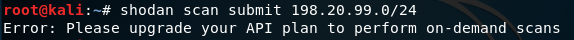
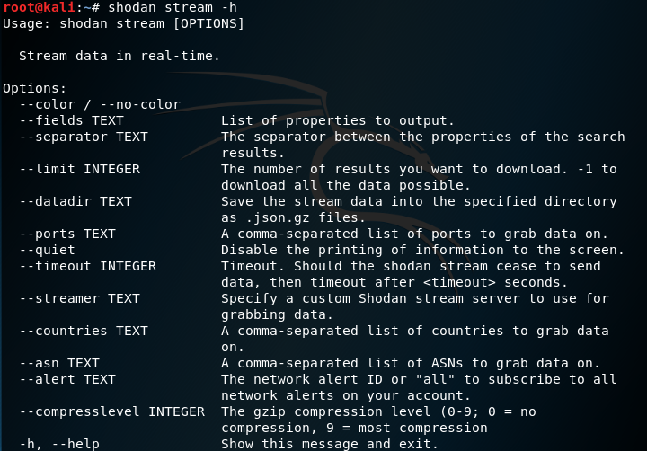

# shodan

# 一、shodan基本介绍
## 1.总体介绍
* Wikipedia上是这样介绍shodan的：“shodan是一个用户可以找到特定类型的计算机的搜索引擎。这些计算机通过各种过滤器连接到互联网上。也有人称它为那些服务器发送回客户机的元数据的搜索引擎。这可以是关于服务器软件的信息、服务支持的选项、欢迎消息或客户端在与服务器交互之前能够发现的任何其他信息。”
* 通俗地说，**shodan**是一个用来搜索互联网连接设备的搜索引擎。它与Google、Bing、百度等这些普通的搜索引擎不同的是，在shodan上用户可以使用shodan搜索语法查找并连接到互联网的设备上，而这些设备，可以是摄像头、路由器、服务器等。
## 2.基本信息
* shodan的搜索流程


* banner是shodan采集的基本数据单位。它描述的是设备所运行服务时的标志性文本信息。banner的内容可以跟着服务类型的变化而变化。例如，对Web服务器来说，banner就将返回标题或telnet登录界面。
以下是几个banner例子：


> 上面的banner显示该设备正在运行一个2.7版本的gSOAP服务器软件。


> 上面的banner显示这是一个西门子S7工控系统协议。其中包含了大量的详细信息，例如公司名称、模块类型、基本固件、模块名称、序号、基本硬件等。


> 注：shodan搜索的是联网设备运行服务时的banner，而不是单一的主机信息。

* 设备元数据
shodan除了获取banner以外，还可以获取相关设备的元数据。比如地址、主机名、操作系统、最近的一次更新时间等。其中大部分元数据可以通过shodan的官网获取，小部分可以通过使用API编程获取。


## 3.数据采集
* 爬虫工作频率
shodan的爬虫全天工作，并实时更新数据库。
* 爬虫分布
爬虫分布在世界各地：美国（东海岸、西海岸）、中国、冰岛、法国、台湾、越南、罗马尼亚、捷克共和国。
从世界各地收集数据是为了防止地区各种因素的差异造成数据的偏差。因此分布在世界各地的shodan爬虫就可以确保任何全国性的封锁不会影响数据收集。
* 爬虫的基本算法
    1.随机生成一个IPv4地址。
    2.从shodan能解析的端口列表中生成一个随机端口测试。
    3.检测随机端口上的随机IPv4地址，并获取Banner。
    4.重复步骤1。
这意味着爬虫不扫描增量的网络范围，而完全是随机的。这样可以防止数据的偏差。
## 4.SSL的收集
shodan也可以收集SSL的banner，包括收集它们的漏洞信息及功能服务。
* heartbleed漏洞

heartbleed漏洞，CVE号是CVE-2014-0160。它的产生是由于未能在memcpy()调用受害用户输入内容作为长度参数之前正确进行边界检查。这样，攻击者可以追踪OpenSSL所分配的64KB缓存、将超出必要范围的字节信息复制到缓存当中再返回缓存内容，这样一来受害者的内存内容就会以每次64KB的速度进行泄露。

如果一个服务heartbleed漏洞，则返回的banner将包含一下两个附加属性:
```
"opts": {
        "heartbleed": "... 174.142.92.126:8443 - VULNERABLE\n",
        "vulns": ["CVE-2014-0160"]
    }
```
> opts.heartbleed包含对服务进行heartbleed漏洞测试的原始回应。

> opts.vulns列表中存放参数来确定设备是否易于受到攻击。如果该设备容易受到攻击，爬虫会将*CVE-2014-0160*添加到opts.vulns列表中。如果该设备不容易受到攻击，爬虫会将!*CVE-2014-0160*添加到opts.vulns列表中。

同时，shodan也支持漏洞信息搜索。使用的过滤器：*vuln* 。它允许通过CVE进行搜索，返回易受特定CVE攻击的设备。但是它是只有具备小型企业开发者会员资格(每月299美元)或学术会员资源的人才能使用的。故这里使用的图片其实来源于网络。


> 上图显示的是：搜索美国受心脏滴血漏洞影响的设备。在shodan中输入country:US vuln:CVE-2014-0160

* FREAK漏洞

FREAK漏洞全称是：Factoring RSA Export Keys，CVE号是CVE-2015-0204。这个漏洞是由于1990年代时，美国软件制造商出口的软件由于规定，只能使用512位或以下的RSA进行加密，而随着计算能力的发展，破解这种加密已经不再是政府机构才能做到的事。这个漏洞还可以和中间人攻击结合使用，只要先破译网站的512位弱加密，再进行中间人攻击，就能使任何允许使用512位出口级密钥的网站失去安全保障。

```
"opts": {
        "heartbleed": "... 174.142.92.126:8443 - VULNERABLE\n",
        "vulns": ["CVE-2014-0160"]
    }
```
> 如果服务支持导出密码，则爬虫将“CVE-2014-0160”添加到opts.vulns列表中。

* Logjam攻击

Logjam攻击属于SSL加密安全漏洞，与FREAK类似，LogJam也是利用90年代美国政府禁止输出高规格加密标准管理方法，诱骗服务器采用较弱、长度较短的512-bit密钥。
LogJam出现在常用的密钥交换加密演算法中，让HTTPS、SSH、IPSec及SMTPS等网络协定产生共享的加密密钥，并建立安全连线。LogJam漏洞使黑客得以发动中间人攻击，让有漏洞的TLS连线降级为512-bit出口等级的密码交换安全性，再读取或修改经由TLS加密连线传输的资料。该漏洞情况与同年三月爆发的FREAK颇为类似，差别在于它是基于TLS协定的漏洞，而非实际的瑕疵，而且攻击目的为Diffie-Hellman，不是RSA的密钥交换。

```
"dhparams": {
    "prime": "bbbc2dcad84674907c43fcf580e9...",
    "public_key": "49858e1f32aefe4af39b28f51c...",
    "bits": 1024,
    "generator": 2,
    "fingerprint": "nginx/Hardcoded 1024-bit prime"
}
```
> 爬虫将短暂使用Diffie-Hellman密码连接到SSL服务，若连接成功就存储返回以上信息。

* 版本

一般情况下，一个浏览器在连接SSL服务时，它应该与服务器一起协商使用的SSL版本和密码。然后它们会统一使用某个版本的SSL用于通信。
shodan的爬虫一开始按照上面所说的方法进行正常请求，与服务器进行协商连接SSL。但是在的得到一个可以用于通信的SSL协议后，还会显式地尝试使用其他的SSL版本连接服务器。也就是说，shodan的爬虫将尝试使用SSLv2、SSLV3、TLSv1.0、TLSv1.1和TLSv1.2连接服务器，来确定该SSL服务支持的所有版本。

收集到的这个信息将在ssl.versions版本字段中显示：
```
    "ssl": {
        "versions": ["TLSv1", "SSLv3", "-SSLv2", "-TLSv1.1", "-TLSv1.2"]
    }
```
> 如果在版本前面有一个“-”符号，则说明该设备不支持该SSL版本。所以，上面的服务器所支持的SSL版本是：TLSv1、SSLv3；不支持：SSLv2、TLSv1.1、TLSv1.2。

同时，版本信息也可以通过shodan网站进行搜索。


>上图就是输入ssl.version:sslv3搜索到的允许使用SSLv3的所有SSL服务。（SSLv3, TLSv1, TLSv1.1, TLSv1.2等）

## 5.两种shodan使用的高级数据分析技术
从大部分情况来看，爬虫试图分析主要的banner文本，然后解析出有用的信息。不过有的情况需要使用两种高级数据分析技术。
* Web组件
当爬虫尝试确定创建网站的web技术时，对于http和https，它将分析header和HTML来分解网站的组件。结果存储到http.components属性中。这个属性是一个技术字典。例如：
```
"http": {
    ...
        "components": {
            "jQuery": {
                "categories": ["javascript-frameworks"]
            },
            "Drupal": {
                "categories": ["cms"]
            },
            "PHP": {
                "categories": ["programming-languages"]
            }
        },
             ...
    },
```
而当我们需要获得所有可能类别的完整列表，使用这个命令：
```
shodan stats --facets http.component_category:1000 http
```
在kali中安装并运行shodan。
安装命令：
```
git clone https://github.com/achillean/shodan-python.git && cd shodan-python
python setup.py install
```


安装好shodan之后首先应该init API_Key
```
shodan init <api key>
```
其中API_Key在创建shodan账号的时候shodan已经分配了。可以在网页版看到属于自己的API_Key。


查看完整列表命令：
```
shodan stats --facets http.component_category:1000 http
```


* 级联
如果一个banner返回了关于对等点的信息，或者有关于另一个运行服务的IP地址的信息，那么爬虫就会试图在这个IP/服务上执行一个banner抓取。
为了跟踪初始扫描请求与任何子级/级联请求之间的关系，我们引入了2个新属性：
1. _shodan.id：banner的唯一ID。如果可以从服务启动级联请求，这个属性就一定存在，但这并不一定意味着级联请求会成功。
2. _shodan.options.referrer：提供触发创建当前banner的banner的唯一ID。即引用者是当前banner的父代。

# 二、shodan的Web界面
一般情况下，使用shodan收集数据，最简单的方法就是通过Web界面。
## 1. shodan网址基本信息
* 这是shodan的网址：[shodan](https://www.shodan.io/)。
* 这是shodan的首页：


其中，左侧是大量的数据汇总，包括：
TOTAL RESULTS:总共的结果
TOP COUNTRIES:使用该类设备最高的国家
TOP ORGANIZATIONS:使用该类设备最高的组织
TOP OPERATING SYSTEMS:使用该类设备最高的操作系统
TOP PRODUCTS:使用该类设备最高的产品或软件

## 2. 搜索查询说明
* 默认情况下，搜索查询只能查看主横幅文本，而不能搜索元数据。
例如：搜索“Google”，则返回结果里将只包含标题中显示“Google”的文本结果。也即，会返回许多组织购买并连接到Internet的谷歌搜索设备;而不返回谷歌的服务器。
* shodan支持匹配所有搜索项的结果，也就是各个搜索项是"AND"关系。
* 如果要搜索特定的元数据需要使用过滤器。

## 3. 过滤器的使用
* 过滤器是用来根据用户需求、服务或设备可以使元数据缩小搜索结果的特殊关键字。
注意，过滤器需要登录才能使用。
* shodan的过滤器格式：
```
filtername:value
注意中间没有空格
```
* 使用包含过滤器空间的值，需要用双引号。
例如，搜索北京地区的设备：
```
city:"Beijing"
```


* 想要筛选出多个值可以使用“，”分开，但是注意，过滤语法不允许使用“，”。
例如，
```
port：23,1023 是正确的
```


> 上图过滤出的结果是23号端口和1023号端口上运行telnet的设备。

```
port，hostname，net 是错误的
port:80,8080  city:"beijing" hostname:"baidu.com" 是正确的
```


> 上图过滤出的结果是北京的80端口、8080端口，域名是“baidu.com”的设备。

* 可以使用“-”来排除结果。
```
port:80,8080  -city:"beijing" hostname:"baidu.com"
```


> 上图过滤出的结果是不在北京的80端口、8080端口，域名是“baidu.com”的设备。

* 使用“-hash：0”来搜索主文本标题为空的搜索结果。

```
port:80 -hash:0 
```


> 上图过滤出的结果是80号端口主文本标题为空的设备。

这是因为shodan上的每一个banner都有一个哈希值，而空的banner对应的哈希值就是0。如果需要搜索简短的、静态的banner，使用哈希值会比较便捷。

* 过滤器

过滤器名|描述|例子
-|:-:|-:
before/after|指定收录时间前后的数据，格式：dd-mm-yy|before:"11-11-18"
category|现有的分类：ics、malware|category:"malware"
city|城市名字|city:"beijing"
country|国家名字简写|country:"CN"
geo|经纬度|geo:"116.403849,39.915446"
hostname|主机名或域名|hostname:"google"
isp|ISP供应商|isp:"China Telecom"
net|CIDR格式的IP地址|net:190.30.40.0/24
org|组织或公司|org:"google"
os|操作系统|os:"Linux"
port|端口号|port:80
product|软件或平台|product:"Apache httpd" product:"openssh"
version|软件版本|version:"2.6.1"

## 4. 搜索引擎
默认情况，搜索查询将查看过去30天内收集的数据。
* 下载数据
如图，在搜索完成之后，会出现一个“Download Results”


点击该按钮，会弹出对话框，可以选择以JSON、CSV、XML（已弃用）格式下载搜索结果。


JSON格式的文件，每行都包括全部的banner 和所有的元数据。是保存数据信息的首选格式。其中格式与shodan命令行客户端兼容，可以从shodan网站下载数据，然后使用终端进一步处理。
CSV格式的文件，返回包含IP、端口、banner
、组织和主机名内容。但它不包含由于CSV文件的格式限制手机的所有shodan信息。当只需要关心结果的基本信息，并期望导出速度很快时，可以使用这个格式的文件。

* 生成报告
shodan可以根据搜索查询结果生成报告。其中可以包含图表。


* 分享结果
可以分享搜索查询结果给其他shodan用户。


## 5. shodan地图
shodan地图网址：[Shodan Maps](https://maps.shodan.io)


使用shodan地图进行搜索，可以直观显示地理位置。


## 6. shodan Exploits
shodan Exploits网址：[Shodan Exploits](https://exploits.shodan.io)


Shodan Exploits可以收集来自CVE、Exploit DB和Metasploit的漏洞和攻击。这样用户就可通过Web界面进行搜索。
但是需要注意，Shodan Exploit搜索的结果不同于Shodan，Exploit搜索的内容包括exploit的信息和元数据。

名称|描述|例子
-|:-:|-:
author|作者名|author:"Tom Ferris"
description|描述|description:"remote"
platform|平台|platform:"php"
type|漏洞类型|type:"remote"


## 7. shodan 图片
shodan图片地址：[Shodan Images](https://images.shodan.io)

由于shodan images 同样是付费使用，故图片也来自网络。


## 8. 图标搜索
通过已知的icon hash搜索目标
* 获取百度的地址。
在本机上ping通百度，然后获得百度的地址：123.125.115.110。


* 查看原数据
使用shodan搜索123.125.115.110，并找到原始数据。


* 在原数据里面找到"data.1.http.favicon.hash"，其值为："-1507567067“


* 在shodan中搜索："http.favicon.hash:-1507567067"。可以找到shodan所收录的百度的网站。


# 三、shodan的外部工具
## 1. 使用kali的命令行shodan
* 安装shodan。
第一种方法：
```
git clone https://github.com/achillean/shodan-python.git && cd shodan-python
python setup.py install
```


第二种方法：
```
easy_install shodan
```

* 初始化shodan
安装好shodan之后首先应该使用API对其进行初始化操作
```
shodan init <api key>
```
其中API_Key在创建shodan账号的时候shodan已经分配了。可以在网页版看到属于自己的API_Key。


* alert命令
alert命令提供创建、列表、清除和删除网络提醒的能力。
```
shodan alert
```


* convert命令
convert命令是用来导出shodan的搜索结果文件，比如JSON文件。


* count命令
count命令用来查询结果
```
shodan count +...
```


* download命令
download命令用来搜索shodan并将结果导出到JSON文件中。
默认只下载1000个结果。如果想要获得更多的结果，需要加上```--limit```标志。
download命令可以保存搜索结果到本地。使用```parse```命令处理结果，当再次导出相同内容的时候，就可以不花积分导出了。
```
shodan download +...
```


* host命令
host命令用来查看有关主机的信息，例如国家、城市、组织、开放的端口等等。
```
shodan host +...
```


* honeyscore命令
honeyscore命令用来检查IP地址是否为蜜罐。
```
shodan honeyscore +...
```


* info命令
info命令用来查询自己的API账户信息。其中包括本月剩余的查询次数和扫描积分数量。
```
shodan info
```


* myip命令
myip命令用来返回本机的出口IP。
```
shodan myip
```


* parse命令
parse命令用来分析并使用导出的搜索结果。一般与download命令一起使用。它可以过滤出感兴趣的字段，也可以将JSON转换为CSV。


* scan命令
```scan```命令提供了一些子命令。其中```submit```命令可以使用shodan进行网络扫描。
默认情况下，它将显示IP、端口、主机名和数据。可以使用```--fields```来打印任何需要的banner字段。



但是很遗憾的，scan命令也需要专业账号才能使用。故图片来源自网络。
```
shodan scan submit 198.20.99.0/24
```


* search命令
search命令搜索的时候，终端将以命令行形式显示结果。默认打印IP、端口、主机名和数据。同样，可以使用```--fields```来打印任何需要的banner字段。

```
shodan search --fields ip_str，port，org，hostnames microsoft iis 6.0
```


* stats命令
stats命令提供关于搜索的摘要信息，也可以用于统计信息。
例如，使用命令行来显示Apache Web服务器所在的最常用的国家。
```
shodan stats --facets country apache
```


* stream命令
stream命令提供shodan爬虫的实时数据流。



stream命令的```--limit```选项：可以指定应下载多少结果。默认情况下，该stream命令将一直运行，直到退出该工具。

stream命令的```--datadir```选项：可以指定流数据存储的目录，生成的文件格式YYYY-MM-DD.json.gz。

stream命令的```--ports```选项：可以接受逗号分隔端口，收集指定端口记录的清单

## 2. shodan浏览器插件
插件名称：Shodan
插件作者：www.shodanhq.com
插件语言：English (United States)
官方站点：暂无官方站点
插件唯一标识：jjalcfnidlmpjhdfepjhjbhnhkbgleap


# 参考资料
1. [shodan 维基百科](https://en.wikipedia.org/wiki/Shodan_(website))
2. [Complete Guide to Shodan](https://leanpub.com/shodan)
3. [shodan 手册](http://b404.xyz/2018/02/08/Shodan-Manual/)
4. [研究发现SSL新漏洞LogJam 或影响大量服务器](http://soft.yesky.com/144/65610644.shtml)
5. YouTube视频