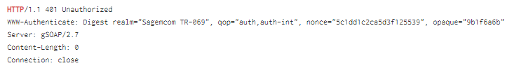
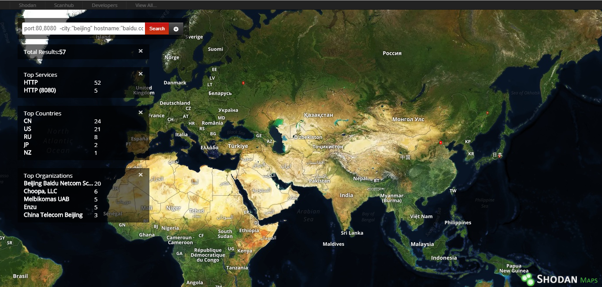

# ZoomEye、shodan类互联网安全垂直搜索引擎使用深度研究

# 一、互联网安全垂直搜索引擎
* 垂直搜索引擎不同于一般的web搜索引擎，它专注于特定的在线的内容，也被称为专业或专题搜索引擎。垂直内容区域可以基于主题、媒体类型或内容类型。
* 本次大作业主要研究的是有关于互联网安全垂直搜索引擎，如：ZoomEye、shodan。前者**ZoomEye**是国内互联网安全厂商**知道创宇**开放的他们的海量数据库，对之前沉淀的数据进行了整合、整理，打造出的一个名符其实的网络空间搜索引擎。后者**shodan**是国外的知名的主机搜索引擎，被誉为“互联网上最可怕的搜索引擎"。 ZoomEye 有些思想也是借鉴了 shodan ，所以本文着重介绍 shodan 搜索引擎的使用。

# 二、ZoomEye基本介绍
## 1. 总体介绍
* ZoomEye 是一款针对网络空间的搜索引擎，收录了互联网空间中的设备、网站及其使用的服务或组件等信息。
* ZoomEye 拥有两大探测引擎：Xmap 和 Wmap，分别针对网络空间中的设备及网站， 通过 24 小时不间断的探测、识别，标识出互联网设备及网站所使用的服务及组件。 研究人员可以通过 ZoomEye 方便的了解组件的普及率及漏洞的危害范围等信息。
* 虽然被称为 “黑客友好” 的搜索引擎，但 ZoomEye 并不会主动对网络设备、网站发起攻击，收录的数据也仅用于安全研究。ZoomEye更像是互联网空间的一张航海图。
## 2.基本信息
* ZoomEye 的主页


* ZoomEye 主机设备搜索

① 组件名称

app：组件名
ver：组件版本
```
app:”Apache httpd” ver:”2.2.16″
```

> Apache httpd, 版本 2.2.16


② 端口

port: 开放端口
```
port:3389
```
>搜索远程桌面连接

```
port:22
```
>搜索 SSH


> 一些服务器可能监听了非标准的端口。要按照更精确的协议进行检索，需使用service: 过滤器。

③ 操作系统

os: 操作系统
```
os:linux
```
> 操作系统为linux


④ 服务

service: 结果分析中的“服务名”字段
```
service:webcam
```
>公网摄像头
```
service:routersetup
```
>公网路由器


⑤ 主机名

hostname：分析结果中的“主机名”字段
```
hostname:google.com
```


⑥ 位置

country: 国家或者地区代码。
city: 城市名称。
```
app:Apache country:US
```
>搜索美国的 Apache 服务器


```
app:Sendmail country:UK
```
>搜索英国的 Sendmail 服务器


⑦ IP地址

ip：搜索一个指定的IP地址
```
ip:8.8.8.8
```
>google的公共DNS服务器


⑧ CIDR

cidr：IP的CIDR网段
```
cidr:8.8.8.8/24
```


* ZoomEye 的 Web 应用搜索
① 网站

site:网站域名
```
site:google.com
```


 
② 标题

title: 页面标题 
```
title:Nginx
```


③ 关键词

keywords: meta name="Keywords" 定义的页面关键词
```
keywords:Nginx
```


④ 描述

desc: meta name="description" 定义的页面说明
```
desc:Nginx
```


⑤ HTTP 头

headers: HTTP 请求中的 Headers
```
headers:Server
```


* ZoomEye 的统计报告
ZoomEye 可以自动生成统计报告：

>统计时间、网站总数、设备总数、全球分布


>全球TOP10


>United States - 数据分布


>United States - 数据统计


>端口分布


>组件分布


* ZoomEye 的全球视角
ZoomEye 可以自动生成全球视角的地图：


* ZoomEye 的相关漏洞


# 三、shodan 基本介绍
## 1.总体介绍
* Wikipedia 上是这样介绍 shodan 的：“ shodan 是一个用户可以找到特定类型的计算机的搜索引擎。这些计算机通过各种过滤器连接到互联网上。也有人称它为那些服务器发送回客户机的元数据的搜索引擎。这可以是关于服务器软件的信息、服务支持的选项、欢迎消息或客户端在与服务器交互之前能够发现的任何其他信息。”
* 通俗地说，**shodan** 是一个用来搜索互联网连接设备的搜索引擎。它与Google、Bing、百度等这些普通的搜索引擎不同的是，在 shodan 上用户可以使用 shodan 搜索语法查找并连接到互联网的设备上，而这些设备，可以是摄像头、路由器、服务器等。
* "Shodan is a search engine for Internet-connected devices. Google lets you search for websites, Shodan lets you search for devices. This library provides developers easy access to all of the data stored in Shodan in order to automate tasks and integrate into existing tools."
## 2.基本信息
* shodan 的搜索流程


* banner 是 shodan 采集的基本数据单位。它描述的是设备所运行服务时的标志性文本信息。banner 的内容可以跟着服务类型的变化而变化。例如，对 Web 服务器来说，banner 就将返回标题或 telnet 登录界面。

以下是几个 banner 例子：



> 上面的 banner 显示该设备正在运行一个 2.7 版本的 gSOAP 服务器软件。


> 上面的 banner 显示这是一个西门子S7工控系统协议。其中包含了大量的详细信息，例如公司名称、模块类型、基本固件、模块名称、序号、基本硬件等。


> 注：shodan 搜索的是联网设备运行服务时的 banner ，而不是单一的主机信息。

* 设备元数据

shodan 除了获取 banner 以外，还可以获取相关设备的元数据。比如地址、主机名、操作系统、最近的一次更新时间等。其中大部分元数据可以通过 shodan 的官网获取，小部分可以通过使用API编程获取。


## 3.数据采集
* 爬虫工作频率

shodan 的爬虫全天工作，并实时更新数据库。
* 爬虫分布

爬虫分布在世界各地：美国（东海岸、西海岸）、中国、冰岛、法国、台湾、越南、罗马尼亚、捷克共和国。
从世界各地收集数据是为了防止地区各种因素的差异造成数据的偏差。因此分布在世界各地的 shodan 爬虫就可以确保任何全国性的封锁不会影响数据收集。
* 爬虫的基本算法

    1.随机生成一个IPv4地址。
    2.从shodan能解析的端口列表中生成一个随机端口测试。
    3.检测随机端口上的随机IPv4地址，并获取Banner。
    4.重复步骤1。

这意味着爬虫不扫描增量的网络范围，而完全是随机的。这样可以防止数据的偏差。
## 4.SSL的收集
shodan也可以收集SSL的 banner ，包括收集它们的漏洞信息及功能服务。
* heartbleed 漏洞

heartbleed 漏洞，CVE号是CVE-2014-0160。它的产生是由于未能在 memcpy()调用受害用户输入内容作为长度参数之前正确进行边界检查。这样，攻击者可以追踪 OpenSSL 所分配的 64KB 缓存、将超出必要范围的字节信息复制到缓存当中再返回缓存内容，这样一来受害者的内存内容就会以每次 64KB 的速度进行泄露。

如果一个服务 heartbleed 漏洞，则返回的 banner 将包含一下两个附加属性:
```
"opts": {
        "heartbleed": "... 174.142.92.126:8443 - VULNERABLE\n",
        "vulns": ["CVE-2014-0160"]
    }
```
> opts.heartbleed 包含对服务进行 heartbleed 漏洞测试的原始回应。

> opts.vulns 列表中存放参数来确定设备是否易于受到攻击。如果该设备容易受到攻击，爬虫会将*CVE-2014-0160*添加到 opts.vulns 列表中。如果该设备不容易受到攻击，爬虫会将!*CVE-2014-0160*添加到 opts.vulns 列表中。

同时，shodan 也支持漏洞信息搜索。使用的过滤器：*vuln* 。它允许通过CVE进行搜索，返回易受特定CVE攻击的设备。但是它是只有具备小型企业开发者会员资格(每月299美元)或学术会员资源的人才能使用的。故这里使用的图片其实来源于网络。


> 上图显示的是：搜索美国受心脏滴血漏洞影响的设备。在 shodan 中输入country:US vuln:CVE-2014-0160

* FREAK漏洞

FREAK 漏洞全称是：Factoring RSA Export Keys，CVE号是CVE-2015-0204。这个漏洞是由于1990年代时，美国软件制造商出口的软件由于规定，只能使用512位或以下的 RSA 进行加密，而随着计算能力的发展，破解这种加密已经不再是政府机构才能做到的事。这个漏洞还可以和中间人攻击结合使用，只要先破译网站的512位弱加密，再进行中间人攻击，就能使任何允许使用512位出口级密钥的网站失去安全保障。

```
"opts": {
        "heartbleed": "... 174.142.92.126:8443 - VULNERABLE\n",
        "vulns": ["CVE-2014-0160"]
    }
```
> 如果服务支持导出密码，则爬虫将“CVE-2014-0160”添加到opts.vulns列表中。

* Logjam 攻击

Logjam 攻击属于 SSL 加密安全漏洞，与 FREAK 类似，LogJam 也是利用90年代美国政府禁止输出高规格加密标准管理方法，诱骗服务器采用较弱、长度较短的512-bit密钥。
LogJam 出现在常用的密钥交换加密演算法中，让HTTPS、SSH、IPSec 及 SMTPS 等网络协定产生共享的加密密钥，并建立安全连线。LogJam 漏洞使黑客得以发动中间人攻击，让有漏洞的 TLS 连线降级为 512-bit 出口等级的密码交换安全性，再读取或修改经由 TLS 加密连线传输的资料。该漏洞情况与同年三月爆发的 FREAK 颇为类似，差别在于它是基于 TLS 协定的漏洞，而非实际的瑕疵，而且攻击目的为 Diffie-Hellman，不是 RSA 的密钥交换。

```
"dhparams": {
    "prime": "bbbc2dcad84674907c43fcf580e9...",
    "public_key": "49858e1f32aefe4af39b28f51c...",
    "bits": 1024,
    "generator": 2,
    "fingerprint": "nginx/Hardcoded 1024-bit prime"
}
```
> 爬虫将短暂使用 Diffie-Hellman 密码连接到 SSL 服务，若连接成功就存储返回以上信息。

* 版本

一般情况下，一个浏览器在连接 SSL 服务时，它应该与服务器一起协商使用的 SSL 版本和密码。然后它们会统一使用某个版本的 SSL 用于通信。
shodan 的爬虫一开始按照上面所说的方法进行正常请求，与服务器进行协商连接 SSL。但是在的得到一个可以用于通信的 SSL 协议后，还会显式地尝试使用其他的 SSL 版本连接服务器。也就是说，shodan 的爬虫将尝试使用 SSLv2、SSLV3、TLSv1.0、TLSv1.1 和 TLSv1.2 连接服务器，来确定该 SSL 服务支持的所有版本。

收集到的这个信息将在 ssl.versions 版本字段中显示：
```
    "ssl": {
        "versions": ["TLSv1", "SSLv3", "-SSLv2", "-TLSv1.1", "-TLSv1.2"]
    }
```
> 如果在版本前面有一个“-”符号，则说明该设备不支持该 SSL 版本。所以，上面的服务器所支持的 SSL 版本是：TLSv1、SSLv3；不支持：SSLv2、TLSv1.1、TLSv1.2。

同时，版本信息也可以通过 shodan 网站进行搜索。


>上图就是输入 ssl.version:sslv3 搜索到的允许使用 SSLv3 的所有 SSL 服务。（SSLv3, TLSv1, TLSv1.1, TLSv1.2 等）

## 5.两种 shodan 使用的高级数据分析技术
从大部分情况来看，爬虫试图分析主要的 banner 文本，然后解析出有用的信息。不过有的情况需要使用两种高级数据分析技术。
* Web 组件

当爬虫尝试确定创建网站的 web 技术时，对于 http 和 https，它将分析 header 和 HTML 来分解网站的组件。结果存储到 http.components 属性中。这个属性是一个技术字典。例如：
```
"http": {
    ...
        "components": {
            "jQuery": {
                "categories": ["javascript-frameworks"]
            },
            "Drupal": {
                "categories": ["cms"]
            },
            "PHP": {
                "categories": ["programming-languages"]
            }
        },
             ...
    },
```
而当我们需要获得所有可能类别的完整列表，使用这个命令：
```
shodan stats --facets http.component_category:1000 http
```
在 kali 中安装并运行 shodan。
安装命令：
```
git clone https://github.com/achillean/shodan-python.git && cd shodan-python
python setup.py install
```


安装好 shodan 之后首先应该 init API_Key
```
shodan init <api key>
```
其中 API_Key 在创建 shodan 账号的时候 shodan 已经分配了。可以在网页版看到属于自己的 API_Key。


查看完整列表命令：
```
shodan stats --facets http.component_category:1000 http
```


* 级联

如果一个 banner 返回了关于对等点的信息，或者有关于另一个运行服务的 IP 地址的信息，那么爬虫就会试图在这个 IP 服务上执行一个 banner 抓取。
为了跟踪初始扫描请求与任何子级/级联请求之间的关系，我们引入了2个新属性：

1. _shodan.id：banner 的唯一 ID。如果可以从服务启动级联请求，这个属性就一定存在，但这并不一定意味着级联请求会成功。
2. _shodan.options.referrer：提供触发创建当前 banner 的 banner 的唯一 ID。即引用者是当前 banner 的父代。

# 四、shodan 的 Web 界面
一般情况下，使用 shodan 收集数据，最简单的方法就是通过 Web 界面。
## 1. shodan 网址基本信息
* 这是 shodan 的网址：[shodan](https://www.shodan.io/)。
* 这是 shodan 的首页：


其中，左侧是大量的数据汇总，包括：

TOTAL RESULTS:总共的结果

TOP COUNTRIES:使用该类设备最高的国家

TOP ORGANIZATIONS:使用该类设备最高的组织

TOP OPERATING SYSTEMS:使用该类设备最高的操作系统

TOP PRODUCTS:使用该类设备最高的产品或软件

## 2. 搜索查询说明
* 默认情况下，搜索查询只能查看主横幅文本，而不能搜索元数据。
例如：搜索“Google”，则返回结果里将只包含标题中显示“Google”的文本结果。也即，会返回许多组织购买并连接到 Internet 的谷歌搜索设备;而不返回谷歌的服务器。
* shodan 支持匹配所有搜索项的结果，也就是各个搜索项是"AND"关系。
* 如果要搜索特定的元数据需要使用过滤器。

## 3. 过滤器的使用
* 过滤器是用来根据用户需求、服务或设备可以使元数据缩小搜索结果的特殊关键字。

注意，过滤器需要登录才能使用。
* shodan 的过滤器格式：
```
filtername:value
注意中间没有空格
```
* 使用包含过滤器空间的值，需要用双引号。
例如，搜索北京地区的设备：
```
city:"Beijing"
```


* 想要筛选出多个值可以使用“，”分开，但是注意，过滤语法不允许使用“，”。
例如，
```
port：23,1023 是正确的
```


> 上图过滤出的结果是23号端口和1023号端口上运行telnet的设备。

```
port，hostname，net 是错误的
port:80,8080  city:"beijing" hostname:"baidu.com" 是正确的
```


> 上图过滤出的结果是北京的80端口、8080端口，域名是“baidu.com”的设备。

* 可以使用“-”来排除结果。
```
port:80,8080  -city:"beijing" hostname:"baidu.com"
```


> 上图过滤出的结果是不在北京的80端口、8080端口，域名是“baidu.com”的设备。

* 使用“-hash：0”来搜索主文本标题为空的搜索结果。

```
port:80 -hash:0 
```


> 上图过滤出的结果是80号端口主文本标题为空的设备。

这是因为 shodan 上的每一个 banner 都有一个哈希值，而空的 banner 对应的哈希值就是0。如果需要搜索简短的、静态的 banner，使用哈希值会比较便捷。

* 过滤器

过滤器名|描述|例子
-|:-:|-:
before/after|指定收录时间前后的数据，格式：dd-mm-yy|before:"11-11-18"
category|现有的分类：ics、malware|category:"malware"
city|城市名字|city:"beijing"
country|国家名字简写|country:"CN"
geo|经纬度|geo:"116.403849,39.915446"
hostname|主机名或域名|hostname:"google"
isp|ISP供应商|isp:"China Telecom"
net|CIDR格式的IP地址|net:190.30.40.0/24
org|组织或公司|org:"google"
os|操作系统|os:"Linux"
port|端口号|port:80
product|软件或平台|product:"Apache httpd" product:"openssh"
version|软件版本|version:"2.6.1"

## 4. 搜索引擎
默认情况，搜索查询将查看过去30天内收集的数据。
* 下载数据
如图，在搜索完成之后，会出现一个“Download Results”


点击该按钮，会弹出对话框，可以选择以 JSON、CSV、XML（已弃用）格式下载搜索结果。


JSON 格式的文件，每行都包括全部的 banner 和所有的元数据。是保存数据信息的首选格式。其中格式与 shodan 命令行客户端兼容，可以从 shodan 网站下载数据，然后使用终端进一步处理。
CSV 格式的文件，返回包含 IP、端口、banner 、组织和主机名内容。但它不包含由于 CSV 文件的格式限制手机的所有 shodan 信息。当只需要关心结果的基本信息，并期望导出速度很快时，可以使用这个格式的文件。

* 生成报告
shodan 可以根据搜索查询结果生成报告。其中可以包含图表。


* 分享结果
可以分享搜索查询结果给其他 shodan 用户。


## 5. shodan地图
shodan 地图网址：[Shodan Maps](https://maps.shodan.io)


使用 shodan 地图进行搜索，可以直观显示地理位置。



## 6. shodan Exploits
shodan Exploits 网址：[Shodan Exploits](https://exploits.shodan.io)


Shodan Exploits 可以收集来自 CVE、Exploit DB 和 Metasploit 的漏洞和攻击。这样用户就可通过 Web 界面进行搜索。
但是需要注意，Shodan Exploit 搜索的结果不同于 Shodan，Exploit 搜索的内容包括 exploit 的信息和元数据。

名称|描述|例子
-|:-:|-:
author|作者名|author:"Tom Ferris"
description|描述|description:"remote"
platform|平台|platform:"php"
type|漏洞类型|type:"remote"


## 7. shodan 图片
shodan 图片地址：[Shodan Images](https://images.shodan.io)

由于 shodan images 同样是付费使用，故图片也来自网络。


## 8. 图标搜索
通过已知的 icon hash 搜索目标
* 获取百度的地址。
在本机上 ping 通百度，然后获得百度的地址：123.125.115.110。


* 查看原数据
使用 shodan 搜索123.125.115.110，并找到原始数据。


* 在原数据里面找到"data.1.http.favicon.hash"，其值为："-1507567067“


* 在 shodan 中搜索："http.favicon.hash:-1507567067"。可以找到 shodan 所收录的百度的网站。


# 五、shodan 的外部工具
## 1. 使用 kali 的命令行 shodan
* 安装 shodan。
第一种方法：
```
git clone https://github.com/achillean/shodan-python.git && cd shodan-python
python setup.py install
```


第二种方法：
```
easy_install shodan
```

* 初始化 shodan
安装好 shodan 之后首先应该使用 API 对其进行初始化操作
```
shodan init <api key>
```
其中 API_Key 在创建 shodan 账号的时候 shodan 已经分配了。可以在网页版看到属于自己的 API_Key。


* alert 命令
alert 命令提供创建、列表、清除和删除网络提醒的能力。
```
shodan alert
```


* convert 命令
convert 命令是用来导出 shodan 的搜索结果文件，比如 JSON 文件。


* count 命令
count 命令用来查询结果
```
shodan count +...
```


* download 命令
download 命令用来搜索 shodan 并将结果导出到 JSON 文件中。
默认只下载 1000 个结果。如果想要获得更多的结果，需要加上```--limit```标志。
download 命令可以保存搜索结果到本地。使用```parse```命令处理结果，当再次导出相同内容的时候，就可以不花积分导出了。
```
shodan download +...
```


* host 命令
host 命令用来查看有关主机的信息，例如国家、城市、组织、开放的端口等等。
```
shodan host +...
```


* honeyscore 命令
honeyscore 命令用来检查IP地址是否为蜜罐。
```
shodan honeyscore +...
```


* info 命令
info 命令用来查询自己的API账户信息。其中包括本月剩余的查询次数和扫描积分数量。
```
shodan info
```


* myip 命令
myip 命令用来返回本机的出口 IP。
```
shodan myip
```


* parse 命令
parse 命令用来分析并使用导出的搜索结果。一般与 download 命令一起使用。它可以过滤出感兴趣的字段，也可以将 JSON 转换为 CSV。


* scan 命令
```scan```命令提供了一些子命令。其中```submit```命令可以使用 shodan 进行网络扫描。
默认情况下，它将显示 IP、端口、主机名和数据。可以使用```--fields```来打印任何需要的 banner 字段。


但是很遗憾的，scan 命令也需要专业账号才能使用。故图片来源自网络。
```
shodan scan submit 198.20.99.0/24
```


* search 命令
search 命令搜索的时候，终端将以命令行形式显示结果。默认打印 IP、端口、主机名和数据。同样，可以使用```--fields```来打印任何需要的 banner 字段。

```
shodan search --fields ip_str，port，org，hostnames microsoft iis 6.0
```


* stats 命令
stats 命令提供关于搜索的摘要信息，也可以用于统计信息。
例如，使用命令行来显示 Apache Web 服务器所在的最常用的国家。
```
shodan stats --facets country apache
```


* stream 命令
stream 命令提供 shodan 爬虫的实时数据流。


stream 命令的```--limit```选项：可以指定应下载多少结果。默认情况下，该stream 命令将一直运行，直到退出该工具。

stream 命令的```--datadir```选项：可以指定流数据存储的目录，生成的文件格式 YYYY-MM-DD.json.gz。

stream 命令的```--ports```选项：可以接受逗号分隔端口，收集指定端口记录的清单

* shodan 的三种积分
shodan 一共有三种积分：

①Export credits

②Query credits

③Scan credits

官方对三种积分的解释是这个网址:[Shodan Credits Explained](https://help.shodan.io/the-basics/credit-types-explained)

简单来说:

```Export credits```是在shodan官网上下载数据的时候使用的。其中1 export credit = 10,000 results。导出一次结果消耗一个credit，但无论获取的结果有多少，都消耗一个credit。一次结果最多为10000个。月初不会更新。

```Query credits```是在调用API时使用。其中1 query credit = 100 results。月初更新。

```Scan credits```同样是在调用API时使用。其中1 scan credit = 1 IP。月初更新。


## 2. shodan 浏览器插件
插件名称：Shodan

插件作者：www.shodanhq.com

插件语言：English (United States)

官方站点：暂无官方站点

插件唯一标识：jjalcfnidlmpjhdfepjhjbhnhkbgleap


# 六、总结
* 通过对 ZoomEye、shodan 类互联网安全垂直搜索引擎使用的研究，发现网络上很多的设备相当于根本没有安全防御措施，通过这两种搜索引擎，可以很轻松地破解并利用它们。
* 但是值得庆幸的是，ZoomEye、shodan 几乎都是用在了好的方面。它们也设置了很多限制，比如没有账户的用户最多只能找到10个搜索结果、不登录的话不可以使用过滤器、根据你所搜索的结果来计费或是要求你的身份必须严格处于安全的限制内等等。
* 不可否认的是，现阶段也会有坏蛋使用 ZoomEye、shodan 来进行攻击，但大多数网络攻击都集中在窃取财物和知识产权上，暂时还没有出现试图摧毁一栋大楼或毁坏市内的红绿灯的攻击。
* 有些安全防御措施的专业人士们不希望使用 ZoomEye 或是 shodan 时搜索到这些没有防御措施的设备及系统。但我认为，ZoomEye、shodan 类互联网安全垂直搜索引擎的存在和是否可以搜索到无防御措施的设备和系统的能力，毕竟是有利有弊的，主要还是看组织或个人以什么目的来使用它。


# 参考资料
1. [垂直搜索 维基百科](https://en.wikipedia.org/wiki/Vertical_search)
2. [ZoomEye的关于我们](https://www.zoomeye.org/about)
3. [ZoomEye用户使用手册](https://blog.csdn.net/ncafei/article/details/63683377)
4. [shodan 维基百科](https://en.wikipedia.org/wiki/Shodan_(website))
5. [Complete Guide to Shodan](https://leanpub.com/shodan)
6. [shodan 手册](http://b404.xyz/2018/02/08/Shodan-Manual/)
7. [研究发现SSL新漏洞LogJam 或影响大量服务器](http://soft.yesky.com/144/65610644.shtml)
8. [官方shodan命令行](https://cli.shodan.io/)
9. [shodan API使用指南](https://www.secpulse.com/archives/73105.html)
10. [Shodan Search Engine Tutorial - Access Routers,Servers,Webcams + Install CLI](https://youtu.be/v2EdwgX72PQ)
11. [Searching the Internet with Shodan (Seen in Mr. Robot)](https://youtu.be/D3QNPGQOfCU)
12. [Penetration Testing - Shodan.io Overview](https://youtu.be/V5f4kqg2Tcs)